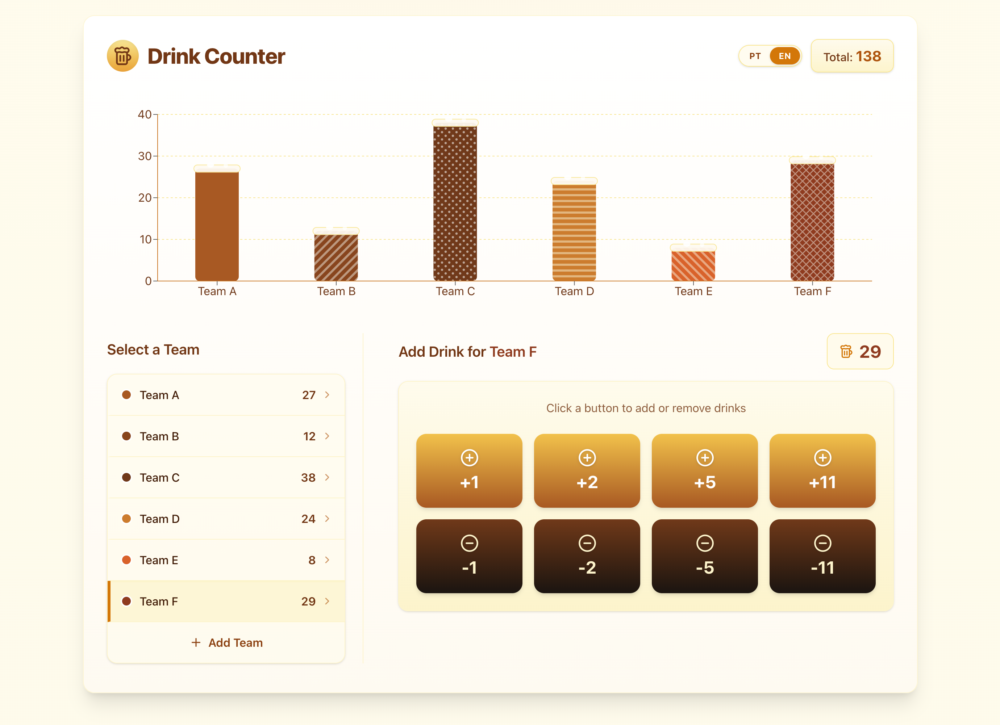

# Beer: Contador de Bebidas

Simple web application to count the number of drinks consumed. Built with Next.js, Tailwind CSS, and TypeScript.

This application allows you to keep track of the number of drinks each team has consumed. You can increase and decrease the count. Removing teams is not allowed since when you are drunk, you might remove one by mistake. :smile:

The application uses browser local storage to persist the data, so you can close the tab and come back later to see your progress.

> To remove, just edit the local storage. :wink:

Simple app made in a few hours to practice as well as to fulfil a need of a friend for a friendly competition to see each team would buy more drinks in a Futsal tournament.

